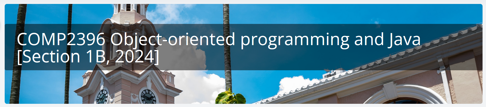

# COMP2396



## Notice for Submission

Remove the following (usually the first line in the code) before submitting
to Moodle VPL:

```java
package some_package;
```

You can ignore the following line in the code as well:

```java
@SuppressWarnings("unused")
```
